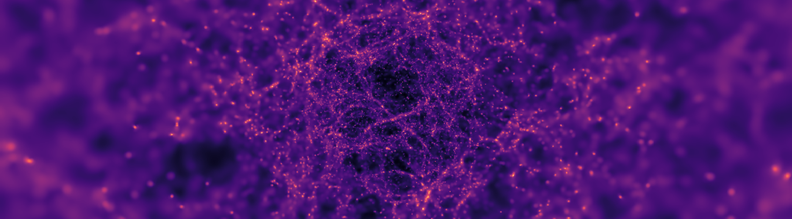

<p align="center">
  
</p>

<h1 align="center">stepsic</h1>

<p align="center">
  <em>Initial condition generator for stereographic cosmological simulations</em>
</p>

<p align="center">
  <a href="https://arxiv.org/abs/2605.10354"></a>
  <a href="https://www.python.org/downloads/"></a>
  
  
</p>

---

## Overview

`stepsic` is both a universal cosmological initial condition generator and the dedicated IC generator for [StePS](https://github.com/eltevo/StePS). Its central purpose is geometry: StePS is the only existing cosmological simulation code that supports open spherical and open-plus-periodic cylindrical simulation volumes, and `stepsic` is the corresponding IC generator for those domains. This is the reason the codebase exists.

For ordinary periodic work, `stepsic` can also generate cubical or rectangular periodic boxes. For StePS, it constructs particle loads and perturbations in stereographically projected spherical and cylindrical geometries that conventional IC generators (`2lptic`, `music`, `monofonic`) do not cover.

The code implements Lagrangian perturbation theory through first and second order, includes a glass-making mode with no perturbations, and propagates displacement fields across the radially varying mass resolution intrinsic to stereographic projections. A constraint-field interface allows bitwise white-noise interoperability with `monofonic` for cross-validation.

Supported geometry families:

- **Cubical/cuboid**: standard boxes with arbitrary aspect ratios and configurable periodic axes.
- **Spherical**: open StePS $\mathbb{R}^3$ geometry for observer-centric, true zoom-in simulations.
- **Cylindrical**: StePS $S^1 \times \mathbb{R}^2$ geometry, periodic along the cylinder axis and open in the stereographic radial directions.
- **PDS**: StePS $S^3/I^*$ (Poincaré Dodecahedral Space) geometry — a regular stereographic grid clipped to the dodecahedral fundamental domain, with conformal-volume ($\Omega^3$) mass weighting for an exactly uniform comoving density on $S^3$, escaped-particle wrapping with the exact velocity Jacobian, and a `/PartType1/Quaternions` dataset in the output (set `GEOMETRY = "pds"`, `PDS_R_CURV`, `TYPE = "grid"`; the quaternion utilities live in `stepsic/pds.py` with unit tests in `tests/test_pds.py`). The LPT displacements use the flat-space $P(k)$ by default; setting `PDS_DISCRETE_NMAX > 0` adds the true **discrete $S^3/I^*$ eigenmode spectrum** ($k_n = \sqrt{n(n+2)}/R_{\rm curv}$, I\*-invariant modes only — the first non-trivial mode is $n=12$, the "missing fluctuations" signature) on the large scales, high-passing the flat field above $k(n_{\max})$ (`stepsic/s3harmonics.py`, `stepsic/s3lpt.py`; tests in `tests/test_s3harmonics.py`).

## Installation

### Conda source checkout

```bash
git clone https://github.com/eltevo/stepsic.git
cd stepsic
conda env create -f environment.yml
conda activate stepsic
```

The conda environment is intended for working from the repository root: running `stepsic.py`, opening the notebooks, and using the validation scripts without an additional editable install step.

Run the generator directly from the checkout:

```bash
python stepsic.py <config.toml>
```

### Minimal Python install

If you only need the Python package and core runtime dependencies, use a Python 3.10+ environment and install from the repository:

```bash
pip install -e .
```

Core dependencies are `numpy`, `scipy`, `astropy`, `h5py`, [CAMB](https://camb.readthedocs.io/), and [colossus](https://bdiemer.bitbucket.io/colossus/). Optional GADGET output requires [`glio`](https://github.com/spthm/glio).

## Quick start

`stepsic` is a Python library with a repository-level driver. The importable package under [stepsic/](stepsic/) contains the geometry, cosmology, field, LPT, IO, and parameter-validation machinery. The top-level [stepsic.py](stepsic.py) script wires those library pieces into a complete initial-condition generator: it reads one TOML configuration, validates it, builds the particle load, applies perturbations when requested, and writes the output files.

Currently, this is the intended working behaviour. Use the library modules when you need individual building blocks, and use `stepsic.py` when you want the full, reproducible IC-generation workflow.

The configuration file is part of that interface. Start from [Template-config.toml](Template-config.toml), and keep each run as a small, reviewable TOML file. A useful first run is a cubical grid IC. It does not require a pre-built glass, so it is the quickest way to check if your environment is working.

```bash
cp Template-config.toml my-ic.toml
```

In `my-ic.toml`, set at least the following values. The comments show the same
contract that the code enforces at startup:

```toml
# Use the ordinary periodic-box path for a first smoke test.
GEOMETRY = "cubical"
TYPE = "grid"

# Build a small regular particle load, and use a modest FFT mesh for the
# displacement and velocity fields.
NGRID = 128
NMESH = 64

# Apply second-order Lagrangian perturbation theory. This is trivially
# preferred over Zel'dovich for any production run.
LPTORDER = 2

# Grid particles already sit on mesh points, so interpolation compensation is
# not necessary for this run.
COMPENSATE = false

# Keep the output directory easy to identify. Most important parameters
# of the run will be encoded in the output name after the prefix.
IC_PREFIX = "quickstart"
```

Then run the full application driver:

```bash
python stepsic.py my-ic.toml
```

During startup, `stepsic.py` delegates the TOML parsing and compatibility checks
to the library parameter layer, then prints the resolved run parameters. The
output directory is built from those parameters under `output/`; the main
snapshot is written as `ic.hdf5`, together with the generated white-noise and
Fourier-space density fields when perturbations are enabled. To inspect an HDF5
snapshot:

```bash
python validation/hdf5inspect.py output/<run-name>/ic.hdf5
```

For a production StePS run, the usual path is:

1. Generate an unperturbed pre-glass with `GEOMETRY = "spherical"` or `"cylindrical"`, `TYPE = "shell"`, and `LPTORDER = 0`.
2. Relax that load into a glass with StePS.
3. Run `stepsic` again with `TYPE = "glass"` and `INPUT_GLASS` pointing to the relaxed glass.
4. Use `NMESH = 0` for adaptive multiscale displacements, or a positive `NMESH` for a single FFT mesh.
5. Run the StePS simulation with the generated initial conditions.

## Configuration

All runtime settings live in one TOML file. The starting point is [Template-config.toml](Template-config.toml), which is intentionally self-documenting; the notes below explain the decisions that most often affect whether a run is physically and numerically sensible.

### Geometry and volume

`GEOMETRY` selects the domain. Use `cubical` for conventional boxes, `spherical` for open StePS spheres, `cylindrical` for StePS cylinders, and `pds` for the StePS Poincaré Dodecahedral Space. `LBOX`, `PERIODIC`, and `COI` define the box dimensions, boundary conditions, and center of interest. In StePS geometries, `R_3D`, `D_4D`, `BIN_MODE`, and `NRBINS` additionally define the stereographic projection and its radial mass-resolution bins. For `pds`, `PDS_R_CURV` sets the curvature radius of $S^3$ and `LBOX` only sizes the LPT FFT mesh (it must enclose the fundamental domain: `min(LBOX) >= 2*PDS_R_CURV*tan(10.7°)`).

For spherical runs, `PERIODIC` is effectively non-periodic in all directions. For cylindrical runs, the axial direction is periodic while the stereographic radial directions are open.

### Particle load

`TYPE` controls the unperturbed particle distribution. `grid` and `random` are for cubical runs. `shell` builds stereographic spherical or cylindrical pre-glass loads and is mainly used with `LPTORDER = 0`. `glass` reads a pre-relaxed load from `INPUT_GLASS`; this is the normal starting point for science ICs in StePS geometries.

The particle-count controls depend on `TYPE`: `NGRID` for a regular cubical grid, `NPART` for a cubical random load, and `NSHELL` with `NRBINS` for shell loads. The template documents the valid combinations and the code validates them at startup.

### Perturbations and resolution

`LPTORDER = 0` writes the unperturbed particle load for glass-making.
`LPTORDER = 1` applies Zel'dovich displacements, and `LPTORDER = 2` applies 2LPT. `REDSHIFT` sets the target initial redshift.

`NMESH > 0` uses one FFT mesh for the displacement and velocity fields.
`NMESH = 0` activates the adaptive multiscale mode used for variable-resolution StePS glass ICs.
The `NMESHSAMPLES` parameter sets the number of sampled mesh levels.
`INTERPOLATION` chooses the grid-to-particle assignment kernel (`ngp`, `cic`, or `tsc`), and `COMPENSATE` applies the corresponding compensation kernel (Cloud-in-Cell does not need compensation).

`SEED`, `PAIRED`, and `PHASE_SHIFT` control random phases and paired ICs for variance-reduction tests.

### Cosmology, spectrum, units, and output

`COSMOLOGY` selects a built-in parameter set from [stepsic/config/cosmology.toml](stepsic/config/cosmology.toml); any explicitly set cosmological parameter in the run config overrides the selected baseline. `SPECTRUM = "camb"` computes the linear power spectrum internally, while `SPECTRUM = "input"` reads a tabulated spectrum from `INPUT_SPECTRUM`.

`COMOVING`, `HINDEPENDENT`, and the `UNIT_*` parameters define the unit conventions. The defaults are chosen for StePS-compatible internal units.

`IC_DIR`, `IC_PREFIX`, `IC_FORMAT`, and `USE_DOUBLE` control where outputs are written and in which precision/format. The run directory name encodes the geometry, resolution, redshift, and LPT settings so multiple runs can share one base output directory.

## Validation

The [validation/](validation/) directory contains end-to-end pipelines that reproduce every figure in the paper:

| Pipeline                                     | What it tests                                                       |
| :------------------------------------------- | :------------------------------------------------------------------ |
| [`grid/`](validation/grid/)                  | *P(k)* recovery vs. resolution, redshift, LPT order, MAS            |
| [`squish/`](validation/squish/)              | Sub-percent *P(k)* recovery in anisotropic boxes up to 10:1         |
| [`cylinder/`](validation/cylinder/)          | Full StePS *N*-body 1LPT vs. 2LPT in cylindrical $S^1 \times \mathbb{R}^2$ geometry     |
| [`monofonic/`](validation/monofonic/)        | Cross-validation against `monofonic` using identical white noise    |
| [`shell-mass/`](validation/shell-mass/)      | Radial particle-mass profile across binning modes                   |
| [`particle-load/`](validation/particle-load/)| All four particle-load configurations visualised                    |
| [`field/`](validation/field/)                | Displacement / velocity field histograms (including slab anisotropy)|

Run all pipelines at minimal resolution to verify your install:

```bash
bash validation/smoke-test.sh
```

## Citation

If you use `stepsic` in published work, please cite:

```bibtex
@article{Pal2026stepsic,
    author        = {P{\'a}l, Bal{\'a}zs and R{\'a}cz, G{\'a}bor and Csabai, Istv{\'a}n and Szapudi, Istv{\'a}n},
    title         = {{stepsic}: {Initial} condition generator for stereographic cosmological simulations},
    year          = {2026},
    eprint        = {2605.10354},
    archivePrefix = {arXiv},
    primaryClass  = {astro-ph.CO},
}
```

## Acknowledgements

Supported by the Hungarian NRDI Office (OTKA NN147550, NKKP-153428, 2025-1.1.5-NEMZ\_KI-2025-0005), the KDP-2021 program, the Research Council of Finland (354905), the European Research Council (KETJU, No. 818930), and NASA ROSES (80NSSC24K1489, 24-ADAP24-0074). Computational resources were provided by CSC — IT Center for Science (Finland) and the Wigner Scientific Computing Laboratory (Hungary).
